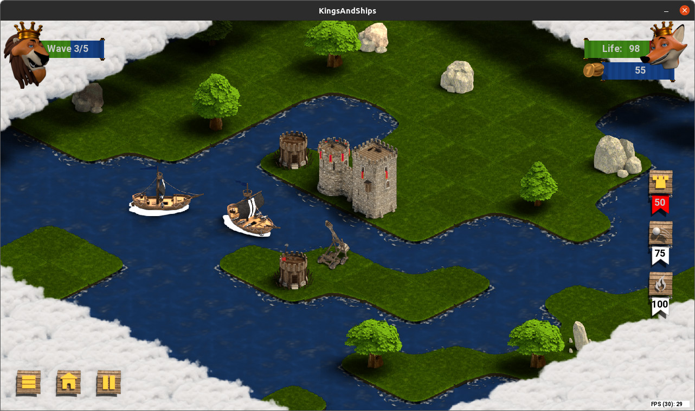

# Kings & Ships
A defense Tower game (Work In Progess) (C++/SDL2)
The king is going back with his ships, but you have taken his throne during his journey. You don't want him to go back. Organize your defense to push him back away and enjoy your new lifestyle.

 
 
The game is under the license: **GPLv3** , and all graphics are under Creative Commons : **CC BY-SA 4.0**

<a rel="license" href="http://creativecommons.org/licenses/by-sa/4.0/"></a><br />This work is licensed under a <a rel="license" href="http://creativecommons.org/licenses/by-sa/4.0/">Creative Commons Attribution-ShareAlike 4.0 International License</a>.

This is work in progress, use it carefully. It has been testing with Debian Stretch and Buster, Ubuntu 20.04 and 22.04 for now.
Meson 0.37 is needed at the minimun.

### Dependencies
```
apt install build-essential git cmake ninja-build gettext libxml++2.6-dev rpm debhelper
apt install libsdl2-dev libsdl2-ttf-dev libfreetype6-dev libxml2-dev libsdl2-image-dev

```

### Download
```
git clone https://github.com/kaochen/KingsAndShips
cd KingsAndShips
```
If you have already the project and you want to synchonize from the server :
```
git pull
```

### Compile
```
mkdir bin
cd bin
cmake -G "Ninja" ..
ninja //ninja-build on CentOS
```

If compilation fail you can try capturing more message by using the "Debug" type :
```
cmake -DCMAKE_BUILD_TYPE=Debug -G "Ninja" ..
```

### Create Package
for Debian family
```
cpack -G DEB
sudo dpkg -i kingsandships*.deb
```

for Red-Hat family
```
cpack -G RPM
sudo yum install kingsandships*.rpm
```

### Play

```
kingsandships
```
From the source folder
```
cd KingsAndShips
./bin/kingsandships
```

 * Drag & drop Tower or Turbines on to the map.
 * Roll the mouse wheel to zoom in or to zoom out
 * Push "n" to send next wave.
 * Push "l" to load the next level.
 * Push "r" to reset level.
 * Push "d" for debug mode.
 * Push "d+p" to get access to the debug path mode.
 * Push "q" to quit.


### change preferences:
edit preferences.ini file from the source file
or when the package is installed from:
/usr/local/share/games/kingsandships/preferences.ini

And change resolution
```
window_width = 1280
window_height = 720
```

## Dev tips:

### create a source package:

```
cd bin
cmake --build . --target package_source
cp kingsandships_*.orig.* ../../
cd ..

```

Build the package using the debian way
```
dpkg-buildpackage -b

```
check if package is ok
```
lintian -EvIL +pedantic kingsandships_*.deb

```
Install :
```
sudo apt install ./../kingsandships_*.deb ./../kingsandships-data*.deb
```
### Localization:  Create a new po file
```
cd po/fr
xgettext --from-code=UTF-8 -s  -o kingsandships.pot ../src/*.cpp
```
Init specific language
```
msginit -l fr -o fr.po -i kingsandships.pot
```
Compile
```
msgfmt -c -v -o kingsandships.mo fr.po
sudo cp kingsandships.mo /usr/share/locale/fr/LC_MESSAGES/
```
Change langage :
```
export LANG=fr_FR.utf-8
```
Run mediascope, check and Go back
```
export LANG=en_GB.utf8
```
Update langage (Only French for now):
```
edit fr.po then 
./updatePO.sh
```
### Graphic tools
#### Tiled
To edit or build levels (Minimum 1.1) http://www.mapeditor.org
```
apt install tiled
```
##### Properties for tileset 
  * unit.type => string ( ArcherTower, boat, barricade, town)
  * unit.health => int (nbr > 0)
  * unit.cost => int (price to pay when build, or reward when kill)
  * unit.rank => int
  * unit.speed => int (0,1,2,3,4)
  * weapon.type => string (NONE,ARCHER,WIND) not used for now
  * weapon.damage => int (damage on ennemy health)
  * weapon.firerange => int (distance is in number of tile around the unit)
  * weapon.firerate => int (milli-second to wait during two shoots)
    
#### Graphics
  * **Blender** for editing graphic elements
  * **ImageMagick** to build tileset from Blender render 
  * **Inkscape** for creating the logo as svg file.
  * **Textures Haven** some textures for blender come from : https://texturehaven.com/
    * Active plugin Node Wrangler in blender . https://docs.blender.org/manual/en/2.90/addons/node/node_wrangler.html
    * Ctrl + Shift + T : https://www.youtube.com/watch?v=iP3_WOl4aco
  * The game use the Promocyja font that is under Public Domain : https://www.dafont.com/promocyja.font

```
apt install blender imagemagick gimp inkscape
```

Build a tileset from images with imagemagick
```
montage Src*.png -tile 8x8 -geometry +0+0 -background none tilset.png
```

New workflow :
Using multiview camera in Blender:
rename to get images in the right order :
```
rename 's/^R_([^_]*)_([^_]*)_([^.]*)/R_$1_$3_$2/' R_*.png
montage R_*.png  -tile 16x8 -geometry +0+0 -background none t_catapult_00.png
```
### Coding tools
Search where improving the code is more usefull
#### linux-perf
```
sudo apt install linux-perf
sudo perf record -g ./build/kingsandships -sleep 10
sudo perf report --sort comm,dso
```

#### Valgind :
```
sudo apt install valgrind
valgrind --leak-check=full --show-leak-kinds=all --log-file=valgrind.log ./kingsandships

```
Then read the valgrind.log (It is helpfull, especialy with a segmentation fault)


#### Git
```
git remote set-url origin git@github.com:kaochen/KingsAndShips.git
```

#### Documentation
##### Generate documentation from source with doxygen: 

```
sudo apt install doxygen graphviz
doxygen doc/Doxyfile
```
access: doc/html/index.html

##### Configure :
```
sudo apt install doxygen-gui
doxywizard
```
And open the file doc/Doxyfile
### Indent

```
apt install astyle
astyle --style=stroustrup --indent=force-tab src/level/level.cpp
```

### Links :

 * https://www.kraxel.org/blog/tag/meson-ninja/
 * http://www.willusher.io/pages/sdl2/
 * http://clintbellanger.net/articles/isometric_math/
 * http://flarerpg.org/tutorials/isometric_tiles/
 * http://doc.mapeditor.org

#### XML : ####

 * https://developer.gnome.org/libxml++-tutorial/stable/
