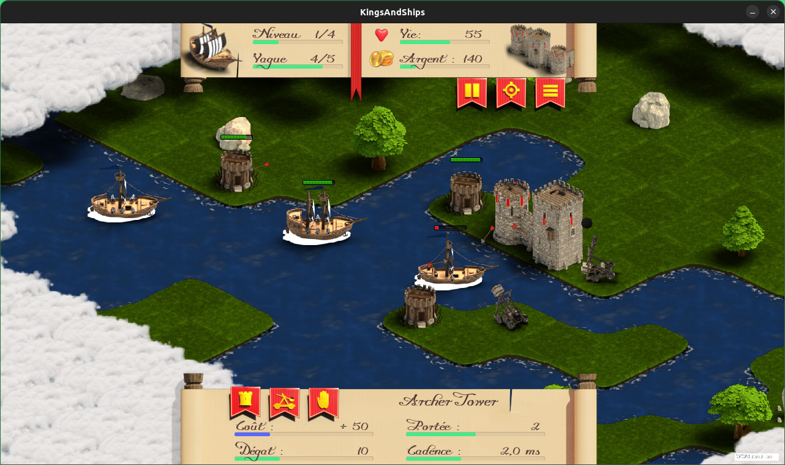

# Kings & Ships
A defense Tower game (Work In Progess) (C++/SDL2)
The king is going back with his ships, but you have taken his throne during his journey. You don't want him to go back. Organize your defense to push him back away and enjoy your new lifestyle.

 
 
The game is under the license: **GPLv3** , and all graphics are under Creative Commons : **CC BY-SA 4.0**

<a rel="license" href="http://creativecommons.org/licenses/by-sa/4.0/"></a><br />This work is licensed under a <a rel="license" href="http://creativecommons.org/licenses/by-sa/4.0/">Creative Commons Attribution-ShareAlike 4.0 International License</a>.

This is work in progress, use it carefully. It has been testing with Debian Stretch and Buster for now.
Meson 0.37 is needed at the minimun.

### Dependencies
```
apt install build-essential git gettext meson libxml++2.6-dev
apt install libsdl2-dev libsdl2-ttf-dev libfreetype6-dev libxml2-dev libsdl2-image-dev fonts-roboto

```

### Download
```
git clone https://github.com/kaochen/KingsAndShips
cd KingsAndShips
```
If you have already the project and you want to synchonize from the server :
```
git pull
```

### Compile
```
meson build
ninja -C build/
```

### Play
```
./build/kingsandships
```

 * Drag & drop Tower or Turbines on to the map.
 * Push "n" to send next wave.
 * Push "l" to load the next level.
 * Push "r" to reset level.
 * Push "d" for debug mode.
 * Push "d+p" to get access to the debug path mode.
 * Push "q" to quit.


## Dev tips:
### Graphic tools
#### Tiled
To edit or build levels (Minimum 1.1) http://www.mapeditor.org
```
apt install tiled
```
##### Properties for tileset 
  * unit.type => string ( ArcherTower, boat, barricade, town)
  * unit.health => int (nbr > 0)
  * unit.cost => int (price to pay when build, or reward when kill)
  * unit.rank => int
  * unit.speed => int (0,1,2,3,4)
  * weapon.type => string (NONE,ARCHER,WIND) not used for now
  * weapon.damage => int (damage on ennemy health)
  * weapon.firerange => int (distance is in number of tile around the unit)
  * weapon.firerate => int (milli-second to wait during two shoots)
  * weapon.speedImpact => int (0,1,2,3) to slow down a boat (against unit.speed). 
    
#### Blender and imagemagick
  * **Blender** for editing graphic elements
  * **ImageMagick** to build tileset from Blender render 

```
apt install blender imagemagick
```

Build a tileset from images with imagemagick
```
montage Src*.png -tile 8x8 -geometry +0+0 -background none tilset.png
```

### Coding tools
Search where improving the code is more usefull
#### linux-perf
```
apt install linux-perf
sudo perf record -g ./build/kingsandships -sleep 10
perf report --sort comm,dso
```

#### Git
```
git remote set-url origin git@github.com:kaochen/KingsAndShips.git
```

#### Documentation
##### Generate documentation from source with doxygen: 

```
apt install doxygen doxygen-gui graphviz
doxygen doc/Doxyfile
```
access: doc/html/index.html

##### Configure :
```
sudo apt install doxygen-gui
doxywizard
```
And open the file doc/Doxyfile
### Indent

```
apt install astyle
astyle --style=stroustrup --indent=force-tab src/level/level.cpp
```

### Links :

 * https://www.kraxel.org/blog/tag/meson-ninja/
 * http://www.willusher.io/pages/sdl2/
 * http://clintbellanger.net/articles/isometric_math/
 * http://flarerpg.org/tutorials/isometric_tiles/
 * http://doc.mapeditor.org

#### XML : ####

 * https://developer.gnome.org/libxml++-tutorial/stable/
